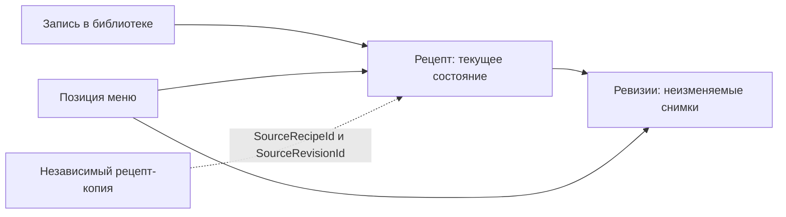

# Версионирование, копии и жизненный цикл рецептов

Документ описывает фактическое поведение текущей реализации. Историческое архитектурное решение зафиксировано в [ADR-0015](../adr/0015-recipe-revisions-library-and-forks.md).

## Коротко

- Рецепт — это текущая редактируемая проекция и набор неизменяемых ревизий его содержимого.
- Создание рецепта сразу создает ревизию № 1.
- Каждый успешный запрос сохранения формы рецепта создает следующую ревизию, даже если данные фактически не изменились.
- Сохранение чужого публичного рецепта в библиотеку не копирует и не фиксирует его версию: библиотека продолжает показывать актуальное состояние оригинала.
- Позиция меню, напротив, фиксирует конкретную ревизию. Последующие изменения оригинала не меняют ингредиенты запланированного блюда и рассчитанный по нему список покупок.
- Копия — новый независимый приватный рецепт с новым владельцем и собственной ревизией № 1. Она хранит ссылку на рецепт-источник и точную исходную ревизию.
- Удаление рецепта сейчас всегда логическое. Запись рецепта, его ревизии и связи остаются в базе независимо от того, используется рецепт или нет.
- Уведомлений об изменениях сохраненного чужого рецепта, сравнения ревизий, ручного обновления и отката сейчас нет.

## Основные сущности

### Рецепт

Запись рецепта содержит владельца, текущее содержимое, видимость, номер текущей ревизии, `CurrentRevisionId`, признаки удаления и происхождение копии. Только владелец может изменять и удалять рецепт.

### Ревизия

Ревизия — неизменяемый снимок содержимого рецепта на момент сохранения. Нумерация начинается с 1 и ведется отдельно для каждого рецепта.

В ревизию входят:

- название и описание;
- количество порций и категория блюда;
- общее и активное время;
- внешняя ссылка на источник;
- ингредиенты, шаги и теги.

В ревизию не входят:

- владелец и видимость рецепта;
- признак удаления;
- обложка и изображения шагов;
- состояние библиотеки и избранного;
- происхождение копии.

Изображения живут отдельно от ревизий. Поэтому замена обложки не создает ревизию, а старая позиция меню может начать показывать новую обложку, хотя ее ингредиенты по-прежнему зафиксированы старой ревизией.

### Запись в библиотеке

Запись в библиотеке хранит только пару «пользователь — рецепт», признак избранного и время сохранения. Она ссылается на живой оригинал и не содержит `RecipeRevisionId` на момент сохранения.

### Позиция меню

Позиция на основе рецепта хранит:

- `RecipeId`;
- конкретный `RecipeRevisionId`;
- снимок названия;
- выбранное количество порций, дату, прием пищи и комментарий.

Снимок ревизии используется при расчете списка покупок. Сам календарь показывает сохраненное название, но обложку получает по текущему `RecipeId`. Переход из календаря открывает текущую версию рецепта, а не экран зафиксированной ревизии.

## Права и общие правила

- Новый собственный рецепт автоматически появляется в библиотеке владельца.
- Только владелец может редактировать и удалять рецепт, а также управлять его изображениями.
- Другой пользователь может читать, сохранять, копировать и добавлять в меню только публичный рецепт.
- Названия рецептов не уникальны. Оригинал и копия могут иметь одинаковое название.
- Изменение количества порций в меню только масштабирует ингредиенты при расчете покупок и не изменяет рецепт.
- Автор не получает уведомления и не видит, кто добавил рецепт в меню. Отдельного пользовательского отчета о сохранениях в чужие библиотеки также нет.
- Передачи владения рецептом и совместного редактирования сейчас нет.

## Когда создается новая ревизия

| Действие | Результат |
| --- | --- |
| Создание вручную или подтверждение импорта | Создается новый рецепт и ревизия № 1 |
| Сохранение формы редактирования (`PUT /api/recipes/{id}`) | Всегда создается следующая ревизия |
| Повтор того же `PUT` с теми же данными | Создается еще одна ревизия; сравнения содержимого нет |
| Изменение только видимости через форму редактирования | Создается ревизия, хотя сама видимость в снимок ревизии не входит |
| Добавление или удаление изображения | Ревизия не создается |
| Добавление в библиотеку или удаление из нее | Ревизия не создается |
| Добавление в избранное или удаление из него | Ревизия не создается |
| Добавление в меню или изменение порций в меню | Ревизия рецепта не создается |
| Логическое удаление рецепта | Ревизия не создается |

Таким образом, «сохранить рецепт» и «сохранить рецепт в библиотеку» — разные операции. Только первая создает новую ревизию.

## Сохранение чужого рецепта в библиотеку

Сохранить можно публичный рецепт. Копия при этом не создается, право редактирования не появляется.

После изменения оригинала владельцем карточка и страница в чужой библиотеке сразу отражают новое текущее состояние. Предыдущая версия для библиотеки не закрепляется, подтверждение обновления не запрашивается.

Если владелец делает рецепт приватным или удаляет его, рецепт исчезает из чужой библиотеки и перестает открываться. Сама запись библиотеки физически остается в базе, но не попадает в пользовательские выборки.

Удаление рецепта из библиотеки не влияет на уже созданные позиции меню и независимые копии. Собственный рецепт нельзя убрать из своей библиотеки этой операцией. Добавление в избранное при необходимости автоматически создает запись в библиотеке; снятие отметки «избранное» запись не удаляет.

## Добавление чужого рецепта в меню

Добавить можно свой рецепт или чужой публичный рецепт. Сохранять чужой рецепт в библиотеку перед этим необязательно.

При добавлении сервер проверяет, что:

- рецепт принадлежит пользователю либо является публичным;
- рецепт не удален;
- переданный `RecipeRevisionId` действительно относится к переданному `RecipeId`.

Интерфейс передает текущую ревизию рецепта. API технически позволяет зафиксировать и более старую ревизию, если клиент знает ее идентификатор и рецепт все еще доступен.

Добавление в меню не создает копию, библиотечную запись или новую ревизию. Изменения оригинала после добавления не меняют зафиксированные ингредиенты, шаги и базовое количество порций. Список покупок продолжает рассчитываться по сохраненной ревизии.

Если пользователь повторно выбирает обновленный рецепт для другой позиции меню, новая позиция получит новую текущую ревизию. Ранее созданные позиции останутся на старой. Автоматического массового обновления позиций нет.

## Копирование

При копировании создается новый рецепт со следующими свойствами:

- новый `RecipeId` и текущий пользователь как владелец;
- приватная видимость независимо от видимости оригинала;
- собственная ревизия № 1;
- содержимое текущей ревизии оригинала на момент копирования;
- `SourceRecipeId` оригинала и `SourceRevisionId` его текущей ревизии;
- автоматическое добавление копии в библиотеку владельца.

Копируются название, описание, порции, категория, времена, внешняя ссылка, ингредиенты, шаги и теги. Изображения, состояние избранного и библиотечные связи не копируются.

После создания копия и оригинал изменяются независимо. Обновления оригинала не попадают в копию, обновления копии не затрагивают оригинал. Удаление или закрытие оригинала не удаляет копию и не мешает ее дальнейшему редактированию.

Backend разрешает владельцу скопировать и собственный рецепт, однако текущий интерфейс показывает действие копирования только для чужого рецепта.

## Изменение оригинала создателем

Последствия зависят от способа использования рецепта:

| Где используется рецепт | Что увидит пользователь после изменения оригинала |
| --- | --- |
| Чужая библиотека | Новое текущее содержимое без уведомления и подтверждения |
| Уже созданная позиция меню | Прежнее название-снимок и прежние ингредиенты ревизии; обложка может обновиться |
| Новая позиция меню | Текущую новую ревизию |
| Независимая копия | Никаких изменений |
| Уже созданный список покупок | Никаких изменений: это отдельный сохраненный список |
| Новый расчет списка покупок по старой позиции меню | Ингредиенты старой зафиксированной ревизии |

## Удаление рецепта

Удаление доступно только владельцу и реализовано как `soft delete`: у рецепта выставляется `IsDeleted`, но строка не удаляется физически.

### Если удаленный рецепт уже есть в чужом меню

- Позиция меню не удаляется и продолжает отображать сохраненное название.
- Ревизия остается в базе, поэтому новый расчет списка покупок продолжает использовать ее ингредиенты.
- Ссылка из меню на страницу рецепта перестает открываться и приводит к состоянию «не найдено».
- Текущая обложка может продолжить отображаться, потому что получение обложки не проверяет `IsDeleted` рецепта.
- Изменить порции, комментарий, дату или прием пищи у такой позиции нельзя: обновление повторно проверяет доступ к рецепту и отклоняется для удаленного рецепта.
- Удалить саму позицию из меню можно.

То же ограничение на редактирование позиции действует и для меню самого создателя после удаления его рецепта.

### Если рецепт нигде не используется

Поведение не отличается: система не проверяет использование и не выполняет физическое удаление. Текущая проекция, все ревизии, изображения и библиотечные записи остаются в хранилищах. Автоматической очистки неиспользуемых рецептов и ревизий сейчас нет.

### Если удален источник копии

Копия остается самостоятельным рабочим рецептом. `SourceRecipeId` и `SourceRevisionId` сохраняются как исторические идентификаторы, даже если источник больше нельзя открыть.

## Смена публичности без удаления

Если создатель делает публичный рецепт приватным:

- рецепт исчезает из чужих библиотек и каталога и перестает открываться чужими пользователями;
- существующие позиции чужого меню и их ревизии сохраняются;
- список покупок по этим позициям продолжает рассчитываться;
- чужой пользователь не может отредактировать такую позицию меню, пока рецепт снова не станет публичным, но может удалить позицию;
- независимые копии не меняются.

## Как пользователь узнает об изменениях

Сейчас — никак. В приложении нет уведомлений, метки «есть новая версия», журнала изменений или сравнения содержимого.

API возвращает текущие `RevisionNumber` и `CurrentRevisionId`, но библиотечная запись не хранит ревизию, которую пользователь видел или сохранял. Поэтому одной текущей модели недостаточно, чтобы надежно определить «обновлено с момента сохранения».

Для копии сохранен `SourceRevisionId`, но автоматического сравнения с текущей ревизией источника и переноса изменений тоже нет.

## История, откат и обновление меню

Ревизии сохраняются в базе, но внешнего API и интерфейса для следующих операций нет:

- показать историю версий;
- открыть конкретную старую ревизию;
- сравнить две ревизии;
- откатить текущий рецепт;
- заменить ревизию в существующей позиции меню на актуальную;
- создать копию непосредственно из выбранной старой ревизии.

Исторические ревизии сейчас являются прежде всего внутренней гарантией воспроизводимости меню и источником ингредиентов для списка покупок.

## Конкурентное редактирование и повторные запросы

Запрос обновления не передает ожидаемый номер ревизии и не использует `ETag` или другой optimistic lock. Два одновременных сохранения могут попытаться создать один и тот же следующий номер ревизии; вместо понятного конфликта редактирования возможна ошибка ограничения базы данных. Это технический пробел текущей реализации.

Повторная отправка успешного запроса обновления не идемпотентна: она создает еще одну ревизию, даже если содержимое совпадает.

## Нерешенные продуктовые вопросы

Следующие пункты не являются частью текущего поведения и требуют отдельных решений перед реализацией:

1. Нужна ли пользователю подписка на обновления всех сохраненных рецептов или только явная метка при открытии библиотеки.
2. Нужно ли хранить в библиотеке `SavedRevisionId` и отдельно `LastSeenRevisionId`, чтобы различать «сохранено», «обновлено» и «просмотрено».
3. Должна ли библиотека показывать актуальный оригинал автоматически или предлагать принять новую версию.
4. Нужен ли пользователю diff, история, откат и сообщение автора к ревизии.
5. Как обновлять позицию меню: только вручную, массово по выбранным позициям или автоматически только для будущих дат.
6. Как отображать удаленный или ставший приватным источник: как недоступный рецепт со снимком, как обычный текстовый пункт или с предложением создать свою копию из сохраненной ревизии.
7. Должны ли изображения входить в ревизию и оставаться визуально неизменными в меню.
8. Следует ли создавать ревизию при сохранении без фактических изменений.
9. Нужна ли политика физической очистки удаленных рецептов и неиспользуемых ревизий, и какие ссылки должны блокировать очистку.
10. Как обрабатывать одновременное редактирование: отклонять устаревшее сохранение, предлагать сравнение или выполнять слияние.
